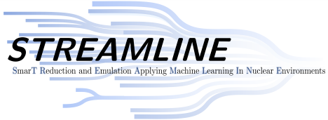

# jaxem



The STREAMLINE members at Ohio University and Ohio State University have developed fast and accurate momentum-space emulators for two-nucleon scattering using an active-learning approach to basis selection.

The corresponding preprint is available at [arXiv:2512.17842](https://arxiv.org/abs/2512.17842).


## Cite this work

Please use the following BibTeX entry to cite this work: 

```bibtex
@article{Giri:2025pkw,
  author        = {Giri, A. and Kim, J. and Drischler, C. and Elster, C.},
  title         = {{Active learning emulators for nuclear two-body scattering}},
  eprint        = {2512.17842},
  archivePrefix = {arXiv},
  primaryClass  = {nucl-th},
  month         = {12},
  year          = {2025}
}
```

## Setting up a virtual environment

First, deactivate any active conda environments (if applicable):
`conda deactivate`

Then, Create a new virtual environment and activate:
`python -m venv myenv`
`source myenv/bin/activate`

## Install the dependencies

Simply run:
`pip install -e .`


## Chiral effective field theory potential

This code utilizes the chiral effective field theory potential from:  
A. Gazerlis et al., Phys. Rev. C 90, 054323 (2014).
[https://doi.org/10.1103/PhysRevC.90.054323](https://doi.org/10.1103/PhysRevC.90.054323)  

The Python interface was written by Christian Drischler and is available in the GitHub repository [`cdrischler/greedy_emulator`](https://github.com/cdrischler/greedy_emulator).  
This repository is included as a submodule named `chiral` within this repo.  

The `chiral` submodule does not update automatically. To explicitly update it, run:  

```bash
git submodule update --remote --merge -- chiral
git add chiral
git commit -m "Updated chiral submodule."
git push origin main
```

To compile the necessary Cython interface, do the following:
```bash
cd chiral
export MYLOCAL=${HOME}/src
make
```


